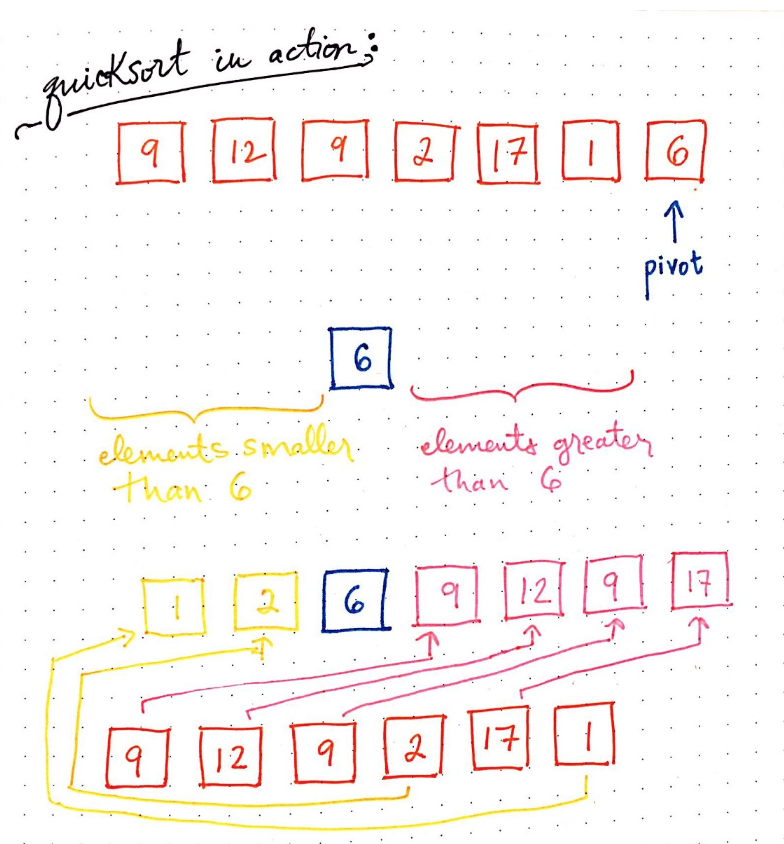
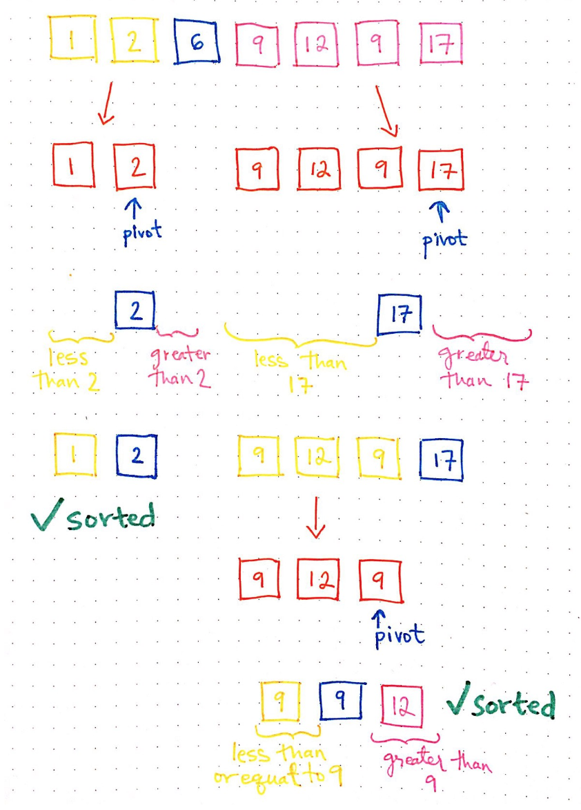
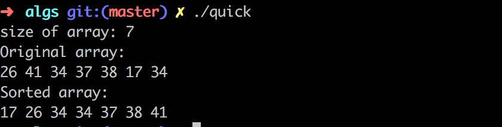

My notes and code about the main algorithm and data structures.

#  Quicksort
  
  **WIP**

  * Quciksort utilizes the divide to conqueror approach
  * Works with the concept of pivot: The pivot can be any of your
    choice, but for efficiency is better to choose wisely. See discuss
    later.
  * Split the array in two parts
    * left: all elements are smaller than pivot
    * right: all elements are bigger than the pivot
  
  
  *The algorithm makes sure that even though each partition is not
  fully sorted, the elements are in the correct order in relation to
  the pivot. That is the power of the quicksort, it is never necessary
  to compare elements from the left partition with the elements of the
  right partition and this reduces to the overall number of
  comparison.*
       
  
   
  * quicksort utilizes recurssion in the two parts of the arrays

  
    
  Quicksort is not always the best algorithm. When the array is
  already ordered or almost ordered it performs like **bubble** sort
  $O(n^2)$.

  * Space order: $O(n)$  
  * Order  
    * worst: $O(n^ 2)$
    * average: $O(n log(n))$
    * best: $O(n log(n))$

  Quicksort can be even optimize by running the recursive calls in
  parallel (reduce the time by half)).

  refs:
  * https://medium.com/basecs/pivoting-to-understand-quicksort-part-1-75178dfb9313
  * https://medium.com/basecs/pivoting-to-understand-quicksort-part-2-30161aefe1d3
  
### Code

See: [here](quicksort.c)

To compile the code 

```sh
g++ -Wall quicksort.c -o quick

# With debug information
g++ -g -DDEBUG -Wall quicksort.c -o quick
```

To run:

```sh
# Create and random array of size 7 and sort it  
./quick
```



# Merge Sort

    **TODO**
    
# Binary Serach

    **TODO**

# Notes

The author believes that share code and knowledge is awesome.  Feel
free to share and modify this piece of code. But don't be impolite and
remember to cite the author and give him his credits.

